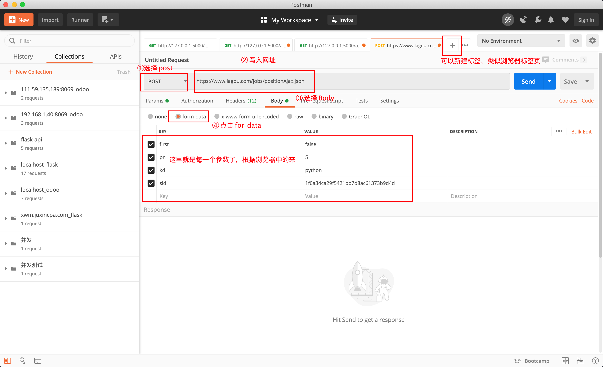
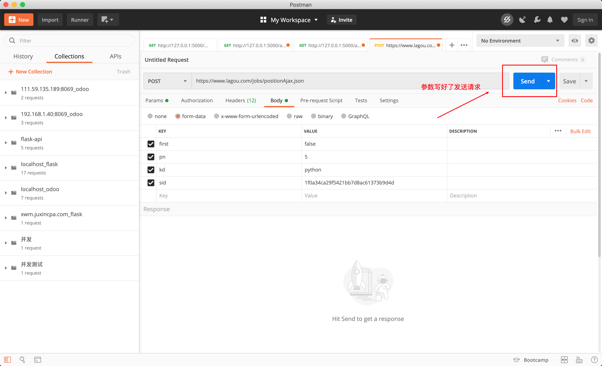
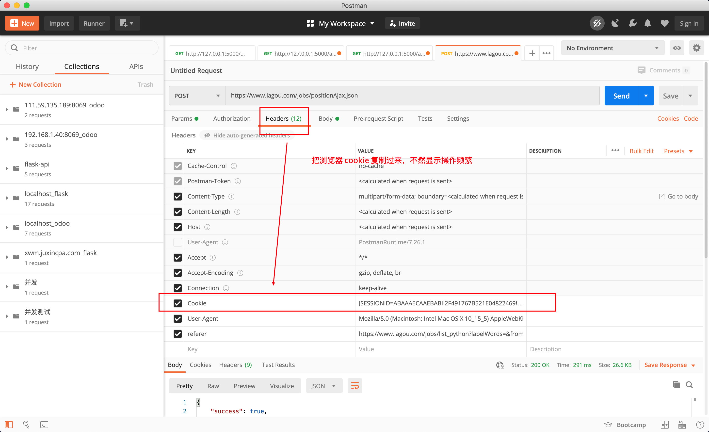
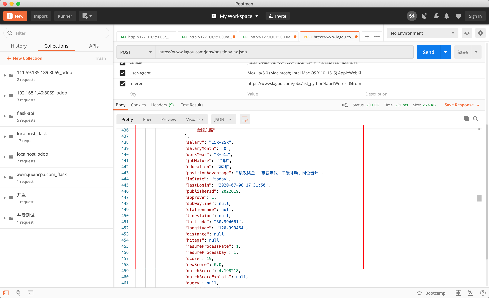

# Learning Notes for Week 03
## Objective for Week 03
Further understanding of the web-scraping framework Scrapy

## Knowledge Tree
* Multiprocessing
	* Why and when multiprocessing in Python
	* Communication between processes
		* Queues
			* Characteristics of queues
			* Important methods: put, get
			* Important parameters: blocked, timeout
			* Examples: communications between (1)parent-child processes; (2) child processes
		* Pipes
		* Shared Memory
	* Locks
* Multithreading
* 自己的疑惑及其厘清
*  作业相关


## Multiprocessing in Python
### Why and when multiprocessing in Python
#### Some helpful resources
* The Why, When, and How of Using Python Multi-threading and Multi-Processing: https://medium.com/towards-artificial-intelligence/the-why-when-and-how-of-using-python-multi-threading-and-multi-processing-afd1b8a8ecca

### Communication between processes


The main sharing approaches:
1. Queues (most frequently used)
2. Pipelines
3. Shared memory

Note that we can't use variables as the shared data among different threads. Reasons: 父进程在创建子进程的时候，对全局变量做了一个备份，父进程中的全局变量与子进程的全局变量完全是不同的两个变量。因此，全局变量在多个进程中不能共享。

Note 2: Wrapping the main part of the application in a check for \_main_ ensures that it is not run recursively in each child as the module is imported.

```python
from multiprocessing import Process
from time import sleep

num = 100

def run():
    print('子进程开始')
    global num
    num += 1
    print('子进程num：{}'.format(num))
    print('子进程结束')

if __name__ == '__main__':
    print('父进程开始')
    p = Process(target=run) 
    # 这个 target 里面被引入的 run 函数就是在主函数（父进程）中新增的一个进程
    p.start() # 子进程启动
    p.join() # 父进程等待子进程结束
    # 在子进程中修改全局变量对父进程中的全局变量没有影响
    print('父进程结束。num: {}'.format(num))
    
# # 输出结果
# 父进程开始
# 子进程开始
# 子进程num：101
# 子进程结束
# 父进程结束。num：100
```


### Queue

FIFO：先入先出

Two most frequently used methods of the class Queue: (1) put: data into the queue; (2) get: data from the queue

通过队列，让父子进程通信的例子：

```python
# 来自官方文档的一个简单demo
# Queue 类是一个近似 queue.Queue 的克隆
# 现在有这样一个需求：我们有两个进程，一个进程负责写(write)一个进程负责读(read)。
# 当写的进程写完某部分以后要把数据交给读的进程进行使用
# write()将写完的数据交给队列，再由队列交给read()

from multiprocessing import Process, Queue

def f(q):
    print('子进程开始')
    q.put([42, None, 'hello']) # 给这个队列放了一个列表
    print('子进程结束')

if __name__ == '__main__':
    print('父进程开始')
    q = Queue()
    p = Process(target=f, args=(q,))
    p.start()
    print(q.get()) # 将队列里的数据取出来
    p.join()
    print('父进程结束')

# 队列是对线程和进程安全的，因为写和读是同时进行的，不会搞乱。
# 即当有一个人往队列中写入东西的时候，其他人处于一种叫阻塞的状态。
# 等第一个人写完了，第二个人才可能往里写。
# 此外，它还能支持多个进程写入。也支持，多个进程往同一个队列写入。

# output:
# 父进程开始
# 子进程开始
# 子进程结束
# [42, None, 'hello']
# 父进程结束
```

#### Put 多次 和 get 多次将会带来的问题

看 Queue 源码，初始化函数里有 maxsize=0，即 Queue 最大存储值能有多大取决于内存。但是在实际工作当中，还是要给队列设置一个最大值，从而避免一些稀奇古怪的错误。举个例子，就像设置超市的最多排队的人数。

get 会有两个比较重要的参数
* blocked
	* 若是 True，则认为目前队列是空的，get就不能一直去取，而是需要等一等，看有没有新的数据进来。如果没有新的数据进来，我要等timeout值，若是等完了timeout值还没有，则抛出 Queue.empty Exception
	* 若是 False，则有两种情况
		* 里面有数据，则直接把数据取出来
		* 里面没有数据，即立即返回 Queue.empty Exception
* timeout

因此，我们在取数据的时候，也可以根据自己的行为来定制 get。如：get取的时候，我到底是一个阻塞的状态，还是一个非阻塞的状态。阻塞状态，可以用A行为；非阻塞状态，可以用B行为。即，可以通过参数去控制取队列的一种状态。

put：队列有max值，即队列会满，满了之后也会有如下的两个参数
* blocked
	* 若是 True，允许put去阻塞，如果队列是满的，则写的人要去等超时时间。等完了超时时间，还没有人来取数据，导致自己无法放数据，那就抛出异常，说明队列是满的（Queue.full exception）。
	* 若是 False，如果队列是满的，则直接抛出异常。
* timeout


增加了阻塞功能的例子（让两个子进程进行通信）：

```python
from multiprocessing import Process, Queue
import os, time

def write(q):
    print('启动Write子进程：{}'.format(os.getpid()))
    for i in ['A', 'B', 'C', 'D']:
        q.put(i) # 写入队列
        time.sleep(1) # 每一秒写一个值
    print('结束Write子进程：{}'.format(os.getpid()))

def read(q):
    print('启动Read子进程：{}'.format(os.getpid()))
    while True: # 阻塞，等待获取write的值，有数据就可以取出来
        # 如果前面读不到值，则一直在这里等着
        # 当能够读取到值的时候，再进行打印
        value = q.get(True)
        print('Get {} out from the queue'.format(value))
    print('结束Read子进程：{}'.format(os.getpid())) 
    # 这一行不会执行，除非设置了timeout，就能主动跳出这个 while true 的死循环


if __name__ == '__main__':
    # 父进程创建队列，并传递给子进程
    q = Queue()
    pw = Process(target=write, args=(q,))
    pr = Process(target=read, args=(q,))
    pw.start()
    pr.start()

    pw.join() # 因为没有设置blocked和timeout，pr进程是一个死循环，无法等待其结束，因此只能强行结束
    # 写进程结束了，所以读进程也结束了
    pr.terminate() # 允许强制结束掉
    print('父进程结束')

# 输出结果：
# 启动Write子进程：23338
# 启动Read子进程：23339
# Get A out from the queue
# Get B out from the queue
# Get C out from the queue
# Get D out from the queue
# 结束Write子进程：23338
# 父进程结束
```

因此，我们可以发现，队列不仅仅是帮助进程间变量传递等通信这么简单，它还引入了更复杂的功能：可以有先后顺序，可以读，也可以写。

### Pipes

Queue 源代码中，底层实现是通过 pipe，只是前者加了一些进程安全和我们使用的功能，后者比前者更原始。

Pipe() 函数返回一个由管道连接的连接对象，默认情况下是双工（双向）。即可以：右边进，左边出；左边进，右边出。

```python

from multiprocessing import Process, Pipe
def f(conn):
    conn.send([42, None, 'hello'])
    conn.close()

if __name__ == '__main__':
    parent_conn, child_conn = Pipe()
    p = Process(target=f, args=(child_conn,))
    p.start()
    print(parent_conn.recv()) # prints "[42, None, 'hello']"
    p.join()
    
 ```
 
返回的两个连接对象 Pipe() 表示管道的两端。每个连接对象都有 send() 和 recv() 方法（相互之间的）。

因为管道比较原始，需要注意的问题：

如果两个进程（或线程）同时尝试读取或写入管道的同一端，则管道中的数据可能会损坏。当然，同时使用管道的不同端的进程不存在损坏的风险。

但是实际上，这样多个人来写入或者读取的情况很多，所以，作为队列的底层知识存在我们了解即可。


### Shared memories

之前我们有提到，为什么我们没有办法在多个进程里面使用同一个变量：因为变量是写入到每一个进程它所占用的内存当中。

如果我们希望多个进程通信的时候能使用变量（这也比较贴近我们原有的使用习惯），则可让多个进程共享其中的一块内存。如何实现：引入 multiprocessing 里面的 Value 和 Array。

提及共享内存的原因：模拟标准的C语言共享内存的方式，加快程序之间去共享数据的效率。在此，我们就可以使用类似于单进程的变量赋值的方式来用


```python

# 在进行并发编程时，通常最好尽量避免使用共享状态。
# 共享内存 shared memory 可以使用 Value 或 Array 将数据存储在共享内存映射中
# 这里的 Array 和 numpy 中的不同，它只能是一维的，不能是多维的。
# 同样和 Value 一样，需要定义数据形式，否则会报错

from multiprocessing import Process, Value, Array

def f(n, a):
    n.value = 3.1415927
    for i in a:
        a[i] = -a[i]

if __name__ == '__main__':
    num = Value('d', 0.0)
    arr = Array('i', range(10))
    # 需要定义好数据类型，这更像编译型语言：
    # 因为要使用内存了，就无法让它动态申请和释放内存，所以就要制定其具体类型。

    p = Process(target=f, args=(num, arr))
    p.start()
    p.join()
    
    # 在父进程中输出：
    print(num.value)
    print(arr[:])
    # 通过冒号把所有的数值进行输出
    # 因此，在子进程完成了赋值，在父进程完成了读取。

# 将打印
# 3.1415927
# [0, -1, -2, -3, -4, -5, -6, -7, -8, -9]
# 创建 num 和 arr 时使用的 'd' 和 'i' 
# 参数是 array 模块使用的类型的 typecode ： 'd' 表示双精度浮点数， 'i' 表示有符号整数。
# 这些共享对象将是进程和线程安全的。
```

### Some helpful resources
* Communication Between Processes: https://pymotw.com/2/multiprocessing/communication.html

## 锁机制

新的特性（队列）能解决旧的问题（进程之间的通信），但是也会引入新的问题：多个人写入的时候，如何保证数据的安全性。

看队列的源码(https://github.com/python/cpython/blob/master/Lib/multiprocessing/queues.py)，在初始化函数中，可以发现有锁的身影：self.\_rlock = ctx.Lock()

如何去用锁机制：队列源码，put 和 get 方法。注意：操作完成之后，要释放锁（self._rlock.release()）。

```python

def put(self, obj, block=True, timeout=None):
   assert not self._closed, "Queue {0!r} has been closed".format(self)
   if not self._sem.acquire(block, timeout):
      raise Full
     
   with self._notempty:
      if self._thread is None:
         self._start_thread()
      self._buffer.append(obj)
      self._notempty.notify()
      
def get(self, block=True, timeout=None):
   if block and time is None:
      with self._rlock:
         res = self._recv_bytes()
      self._sem.release()
   else:
      if block:
         deadline = time.monotonic() + timeout
      if not self._rlock.acquire(block, timeout):
         raise Empty
   try:
      if block:
         timeout = deadline - time.monotonic()
         if not self._poll(timeout):
            raise Empty
      elif not self._poll():
         raise Empty
      res = self._recv_bytes()
      self._sem.release()
  finally:
      self._rlock.release()
  # unserialize the data after having released the lock
  return _ForkingPickler.loads(res)
```

在自己的程序中，也可以这么做。因为 multiprocessing 包中也实现了进程级别的锁供我们使用。

首先，不加锁会产生什么样的问题：

## 自己的疑惑及其厘清
1. 多线程和多进程中的join()方法、daemon

```python
import time
from multiprocessing import Process
import os

def run():
   print('子进程开启')
   time.sleep(5) # 故意设置这么长时间，好看输出结果
   print('子进程结束')
   
if __name__ == '__main__':
   print('父进程启动')
   p = Process(target=run)
   p.start()
   p.join()
   print('父进程结束')
   
# output：
# 父进程启动
# 子进程开启
# 子进程结束
# 父进程结束

# p.join() 若是被注释掉，打印顺序就会产生下面的变化
# 父进程启动
# 父进程结束
# 子进程启动
# 子进程结束
```
程序运行结果：

当 p.join() 没有被注释掉的时候，“父进程启动”、“子进程开启”很快显示在终端，等待五秒之后，“子进程结束”、“父进程结束”才显示在终端。原因是：**join所完成的工作就是进程同步，即主进程任务结束之后，进入阻塞状态，一直等待其他的子进程执行结束之后，主进程再终止**。

当 p.join() 被注释掉的时候，“父进程启动”、“父进程结束”、“子进程启动”很快显示在终端，等待五秒之后，“子进程结束”才显示在终端。原因是：**当一个进程启动之后，因为线程是程序执行流的最小单元，所以会默认产生一个主线程。当设置多线程时，主线程会创建多个子线程，在python中，默认情况下（其实就是setDaemon(False)），主线程执行完自己的任务以后，就退出了，此时子线程会继续执行自己的任务，直到自己的任务结束**。

注意：当我们使用setDaemon(True)方法，设置子线程为守护线程时，主线程一旦执行结束，则全部线程全部被终止执行，可能出现的情况就是，子线程的任务还没有完全执行结束，就被迫停止。例如：

```python
import time
from multiprocessing import Process
import os

def run():
   print('子进程开启')
   time.sleep(5)
   print('子进程结束')
   
if __name__ == '__main__':
   print('父进程启动')
   p = Process(target=run, daemon=False)
   p.start()
#    p.join()
   print('父进程结束')
   
# 当 daemon 字段被设置为 False 且 p.join() 被注释掉:
# 父进程启动
# 父进程结束
# 子进程开启
# 子进程结束

# 当 daemon 字段被设置为 True 且 p.join() 被注释掉：
# 父进程启动
# 父进程结束

# 当 daemon 字段被设置为 False 且 p.join() 并未被注释掉：
# 结果与 当 daemon 字段被设置为 True 且 p.join() 并未被注释掉一致：
# 父进程启动
# 子进程开启
# 子进程结束
# 父进程结束
```
当 daemon 字段被设置为 False 且 p.join() 被注释掉，“父进程启动”、“父进程结束”、“子进程启动”很快显示在终端，等待五秒之后，“子进程结束”才显示在终端，与上个例子中当 p.join() 被注释掉的时候一致。

当 daemon 字段被设置为 True 且 p.join() 被注释掉，“父进程启动”、“父进程结束”很快显示在终端，程序旋即结束。

当 daemon 字段被设置为 False 且 p.join() 并未被注释掉，“父进程启动”、“子进程开启”很快显示在终端，等待五秒之后，“子进程结束”、“父进程结束”才显示在终端。该结果与上个例子中当 p.join() 没有被注释掉的时候一致。

当 daemon 字段被设置为 True 且 p.join() 并未被注释掉，结果与上一个结果一致。

#### 总结
* daemon 字段被设置为 False 等价于 正常工作进程被创建
* 正常工作进程被创建的时候，加上 join() 就表示主进程会等待子进程结束之后，主进程才会结束
* 正常工作进程被创建的时候，若是没有 join()，则表示主进程和子进程各自为政，主进程先完成之后，子进程继续执行，直到子进程执行完毕，整个程序才会关闭。
* 在设置了 join() 之后，子进程是否被设置为守护进程已经对结果没有影响，统一的结果是：主进程会等待子进程结束之后，主进程才会结束

## Assignment 2

### Frontend Knowledge

对一个网页的爬取的关键点在于怎么去找到这些数据的准确位置，而这个前提是了解URL构造，参数、以及请求方式，整明白这些就成功了一大半，对于后边数据的提取就是一些常规的思路。

首先页面分析肯定是玩爬虫的前提条件，如何发现链接、如何抽取有效信息，这些都是需要事先解决的问题，只有找到页面的规律才能进行下一步的操作。以拉勾网为例，其页面的数据并不是由服务端渲染完成后再返回给前端的，而是通过返回json数据，由前端进行渲染展示。所以这就带来了一个问题，之前那种直接抓取页面链接，抽取信息的方法已经无法完成抓取任务了。接下来打开google浏览器的调试工具，我们访问Java相关的招聘页面，并限定工作地点为北京，首先先看Headers部分的信息，其中Response Headers(响应头)和Query String Parameters(查询的字符串参数)这两个部分的信息可不用理会，我们重点来看General、Request Headers和From Data这是三个部分，General包含了请求的URL地址以及请求的方式，划线的部分是转码后的中文北京，不同的城市这一部分是不同的。

### Basic knowledge about links

Q：以北京的python招聘页面为例，地址为 https://www.lagou.com/jobs/list_Python/p-city_2?px=default 但是我发现要是我把最后的这个 ?px=default  删掉其实也是能够正常访问的。我想用删掉 ?px=default 这个部分的链接，但是不知道这样的话是不是就会让服务器识别到咱们不是正常用户操作呢？

A：一般你给其他网站随便加几个没有的参数都行的，随便打的，都有数据，这个是 get 请求参数，一般网站不会去拿它来反爬，只用来根据用户查询参数，返回不同的值。


### Get vs Post


关于 sid 的问题，如果同一个页面，点击下一页他不变，那你就复制出来用一个就行，她可能每打开一个页面就随机生成一个，发送 ajax 请求的时候都是用的当前页面这一个。

### How to use Postman

Why Postman: a more convenient way to deal with API. For example:


How to use Postman:









### Some helpful resources:
* 爬取拉勾网Java开发工程师招聘信息: https://mackvord.github.io/webmagic/49928.html
* 用Python爬取拉勾网的职位信息：https://www.geek-share.com/detail/2753348683.html
* python爬虫----拉勾网爬虫实践： https://blog.csdn.net/sinat_41624848/article/details/101639202
* Python搭建代理池爬取拉勾网招聘信息： https://juejin.im/post/5d5e92916fb9a06ac93cd5f5	*