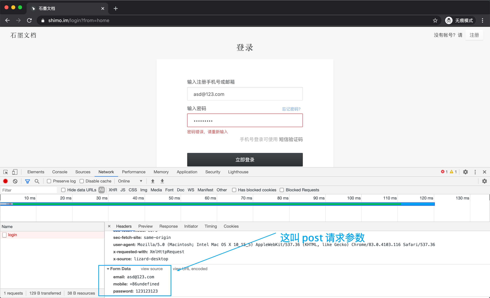
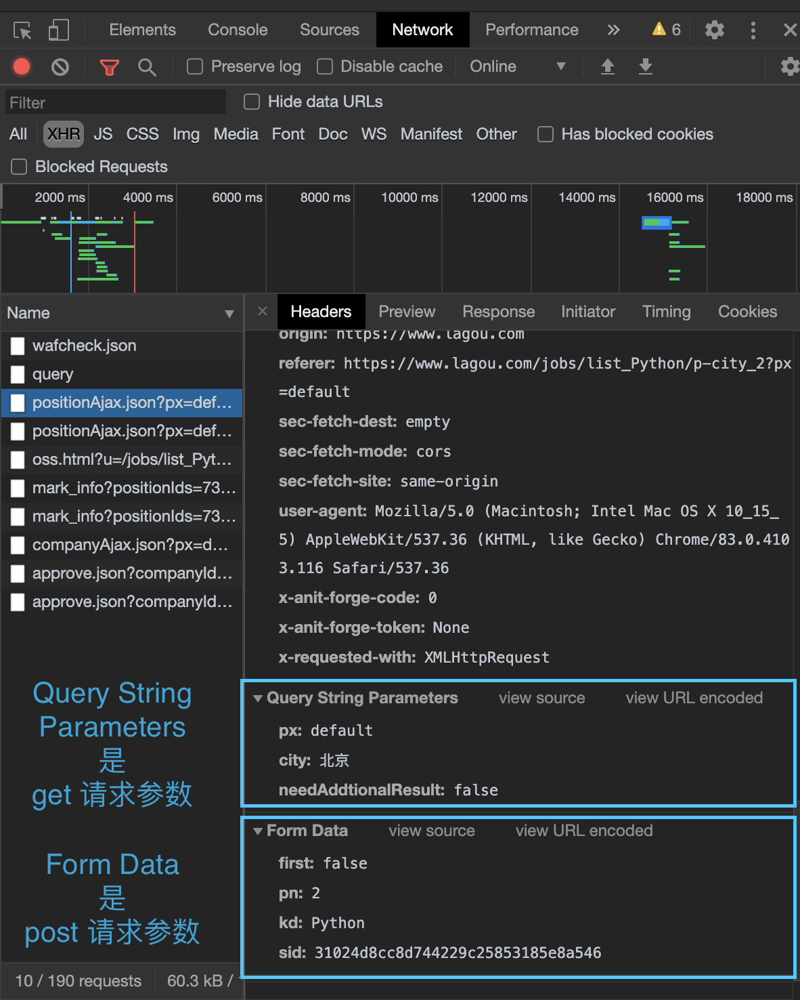
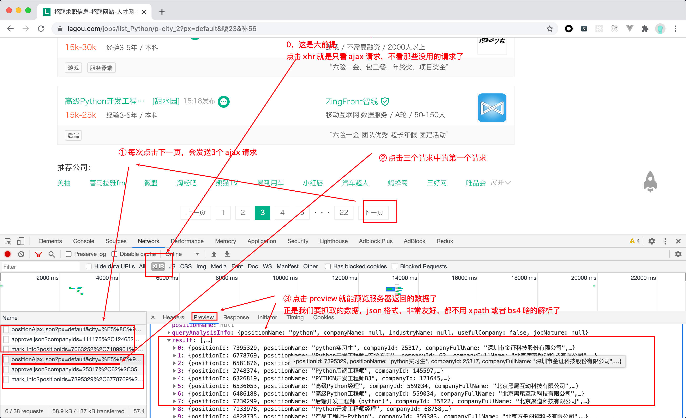
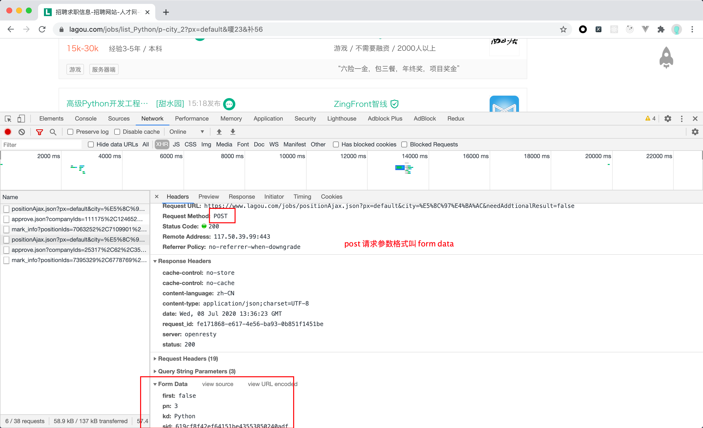
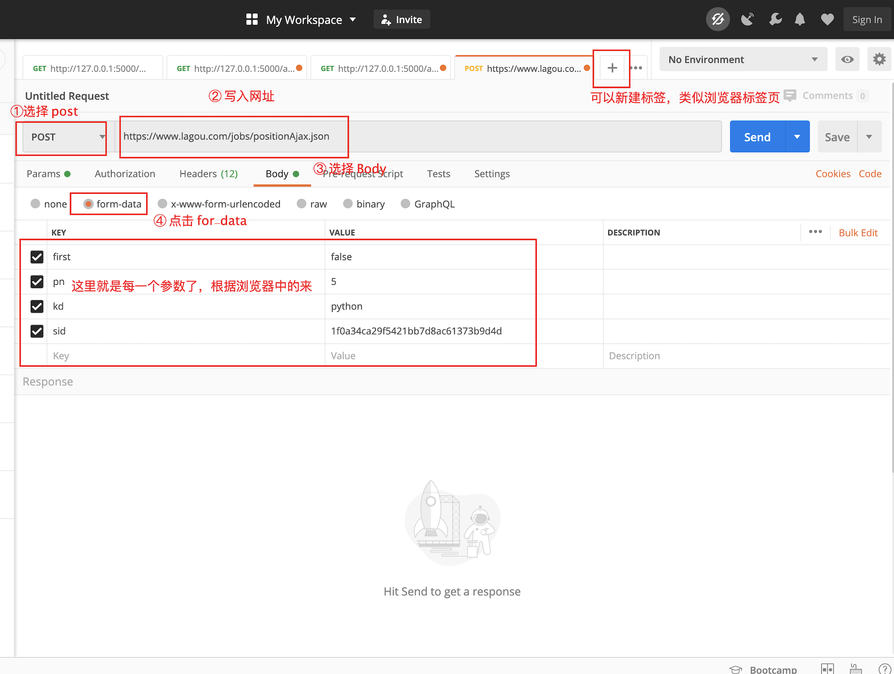
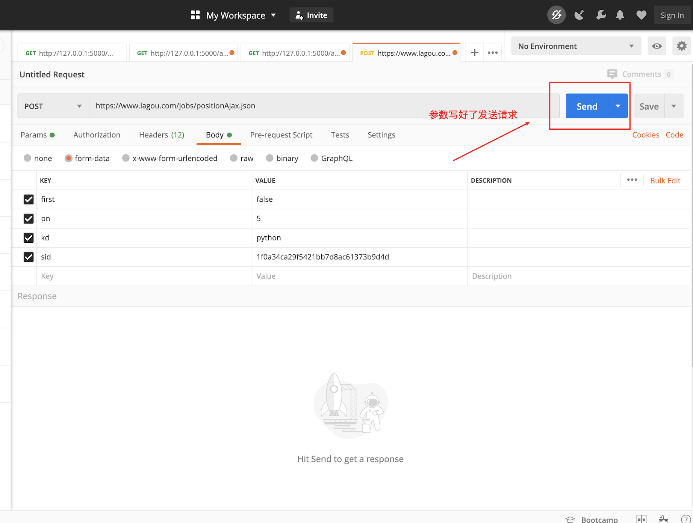
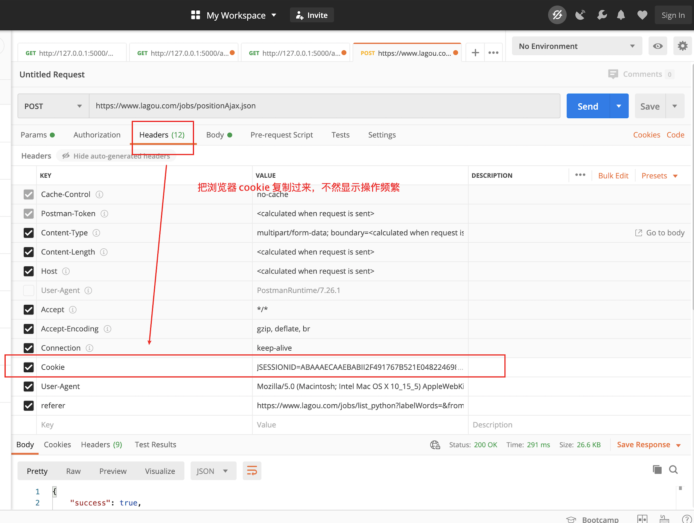
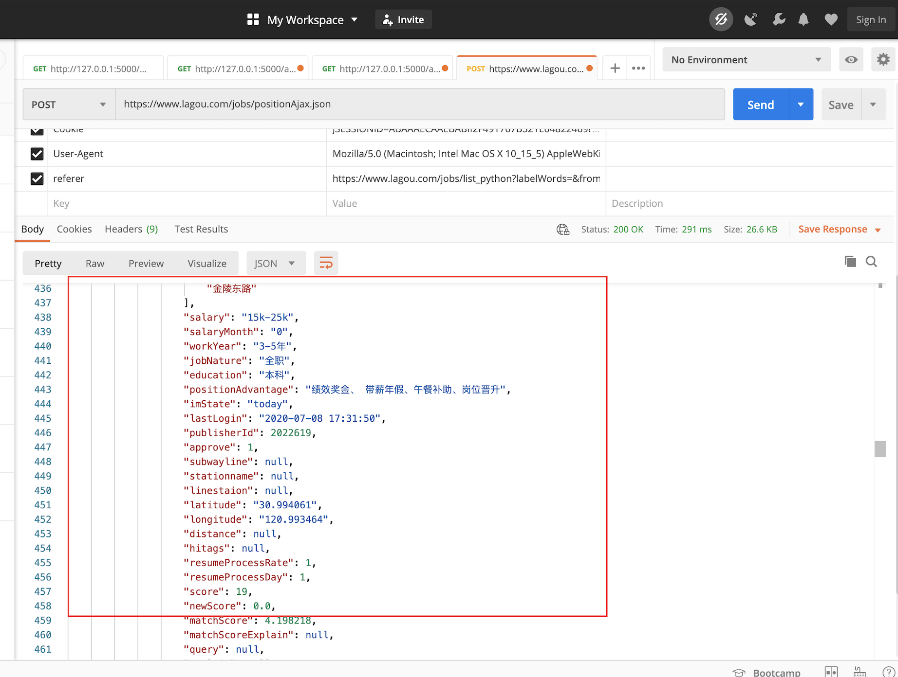

# Learning Notes for Week 03
## Objective for Week 03
Multiprocessing and multithreading

## Knowledge Tree
* Multiprocessing
	* Why and when multiprocessing in Python
	* Communication between processes
		* Queues
			* Characteristics of queues
			* Important methods: put, get
			* Important parameters: blocked, timeout
			* Examples: communications between (1)parent-child processes; (2) child processes
		* Pipes
		* Shared Memory
	* Locks
* Multithreading
* 自己的疑惑及其厘清
*  作业相关


## Multiprocessing in Python
### Why and when multiprocessing in Python
#### Some helpful resources
* The Why, When, and How of Using Python Multi-threading and Multi-Processing: https://medium.com/towards-artificial-intelligence/the-why-when-and-how-of-using-python-multi-threading-and-multi-processing-afd1b8a8ecca

### Communication between processes


The main sharing approaches:
1. Queues (most frequently used)
2. Pipelines
3. Shared memory

Note that we can't use variables as the shared data among different threads. Reasons: 父进程在创建子进程的时候，对全局变量做了一个备份，父进程中的全局变量与子进程的全局变量完全是不同的两个变量。因此，全局变量在多个进程中不能共享。

Note 2: Wrapping the main part of the application in a check for \_main_ ensures that it is not run recursively in each child as the module is imported.

```python
from multiprocessing import Process
from time import sleep

num = 100

def run():
    print('子进程开始')
    global num
    num += 1
    print('子进程num：{}'.format(num))
    print('子进程结束')

if __name__ == '__main__':
    print('父进程开始')
    p = Process(target=run) 
    # 这个 target 里面被引入的 run 函数就是在主函数（父进程）中新增的一个进程
    p.start() # 子进程启动
    p.join() # 父进程等待子进程结束
    # 在子进程中修改全局变量对父进程中的全局变量没有影响
    print('父进程结束。num: {}'.format(num))
    
# # 输出结果
# 父进程开始
# 子进程开始
# 子进程num：101
# 子进程结束
# 父进程结束。num：100
```


### Queue

FIFO：先入先出

Two most frequently used methods of the class Queue: (1) put: data into the queue; (2) get: data from the queue

通过队列，让父子进程通信的例子：

```python
# 来自官方文档的一个简单demo
# Queue 类是一个近似 queue.Queue 的克隆
# 现在有这样一个需求：我们有两个进程，一个进程负责写(write)一个进程负责读(read)。
# 当写的进程写完某部分以后要把数据交给读的进程进行使用
# write()将写完的数据交给队列，再由队列交给read()

from multiprocessing import Process, Queue

def f(q):
    print('子进程开始')
    q.put([42, None, 'hello']) # 给这个队列放了一个列表
    print('子进程结束')

if __name__ == '__main__':
    print('父进程开始')
    q = Queue()
    p = Process(target=f, args=(q,))
    p.start()
    print(q.get()) # 将队列里的数据取出来
    p.join()
    print('父进程结束')

# 队列是对线程和进程安全的，因为写和读是同时进行的，不会搞乱。
# 即当有一个人往队列中写入东西的时候，其他人处于一种叫阻塞的状态。
# 等第一个人写完了，第二个人才可能往里写。
# 此外，它还能支持多个进程写入。也支持，多个进程往同一个队列写入。

# output:
# 父进程开始
# 子进程开始
# 子进程结束
# [42, None, 'hello']
# 父进程结束
```

#### Put 多次 和 get 多次将会带来的问题

看 Queue 源码，初始化函数里有 maxsize=0，即 Queue 最大存储值能有多大取决于内存。但是在实际工作当中，还是要给队列设置一个最大值，从而避免一些稀奇古怪的错误。举个例子，就像设置超市的最多排队的人数。

get 会有两个比较重要的参数
* blocked
	* 若是 True，则认为目前队列是空的，get就不能一直去取，而是需要等一等，看有没有新的数据进来。如果没有新的数据进来，我要等timeout值，若是等完了timeout值还没有，则抛出 Queue.empty Exception
	* 若是 False，则有两种情况
		* 里面有数据，则直接把数据取出来
		* 里面没有数据，即立即返回 Queue.empty Exception
* timeout

因此，我们在取数据的时候，也可以根据自己的行为来定制 get。如：get取的时候，我到底是一个阻塞的状态，还是一个非阻塞的状态。阻塞状态，可以用A行为；非阻塞状态，可以用B行为。即，可以通过参数去控制取队列的一种状态。

put：队列有max值，即队列会满，满了之后也会有如下的两个参数
* blocked
	* 若是 True，允许put去阻塞，如果队列是满的，则写的人要去等超时时间。等完了超时时间，还没有人来取数据，导致自己无法放数据，那就抛出异常，说明队列是满的（Queue.full exception）。
	* 若是 False，如果队列是满的，则直接抛出异常。
* timeout


增加了阻塞功能的例子（让两个子进程进行通信）：

```python
from multiprocessing import Process, Queue
import os, time

def write(q):
    print('启动Write子进程：{}'.format(os.getpid()))
    for i in ['A', 'B', 'C', 'D']:
        q.put(i) # 写入队列
        time.sleep(1) # 每一秒写一个值
    print('结束Write子进程：{}'.format(os.getpid()))

def read(q):
    print('启动Read子进程：{}'.format(os.getpid()))
    while True: # 阻塞，等待获取write的值，有数据就可以取出来
        # 如果前面读不到值，则一直在这里等着
        # 当能够读取到值的时候，再进行打印
        value = q.get(True)
        print('Get {} out from the queue'.format(value))
    print('结束Read子进程：{}'.format(os.getpid())) 
    # 这一行不会执行，除非设置了timeout，就能主动跳出这个 while true 的死循环


if __name__ == '__main__':
    # 父进程创建队列，并传递给子进程
    q = Queue()
    pw = Process(target=write, args=(q,))
    pr = Process(target=read, args=(q,))
    pw.start()
    pr.start()

    pw.join() # 因为没有设置blocked和timeout，pr进程是一个死循环，无法等待其结束，因此只能强行结束
    # 写进程结束了，所以读进程也结束了
    pr.terminate() # 允许强制结束掉
    print('父进程结束')

# 输出结果：
# 启动Write子进程：23338
# 启动Read子进程：23339
# Get A out from the queue
# Get B out from the queue
# Get C out from the queue
# Get D out from the queue
# 结束Write子进程：23338
# 父进程结束
```

因此，我们可以发现，队列不仅仅是帮助进程间变量传递等通信这么简单，它还引入了更复杂的功能：可以有先后顺序，可以读，也可以写。

### Pipes

Queue 源代码中，底层实现是通过 pipe，只是前者加了一些进程安全和我们使用的功能，后者比前者更原始。

Pipe() 函数返回一个由管道连接的连接对象，默认情况下是双工（双向）。即可以：右边进，左边出；左边进，右边出。

```python

from multiprocessing import Process, Pipe
def f(conn):
    conn.send([42, None, 'hello'])
    conn.close()

if __name__ == '__main__':
    parent_conn, child_conn = Pipe()
    p = Process(target=f, args=(child_conn,))
    p.start()
    print(parent_conn.recv()) # prints "[42, None, 'hello']"
    p.join()
    
 ```
 
返回的两个连接对象 Pipe() 表示管道的两端。每个连接对象都有 send() 和 recv() 方法（相互之间的）。

因为管道比较原始，需要注意的问题：

如果两个进程（或线程）同时尝试读取或写入管道的同一端，则管道中的数据可能会损坏。当然，同时使用管道的不同端的进程不存在损坏的风险。

但是实际上，这样多个人来写入或者读取的情况很多，所以，作为队列的底层知识存在我们了解即可。


### Shared memories

之前我们有提到，为什么我们没有办法在多个进程里面使用同一个变量：因为变量是写入到每一个进程它所占用的内存当中。

如果我们希望多个进程通信的时候能使用变量（这也比较贴近我们原有的使用习惯），则可让多个进程共享其中的一块内存。如何实现：引入 multiprocessing 里面的 Value 和 Array。

提及共享内存的原因：模拟标准的C语言共享内存的方式，加快程序之间去共享数据的效率。在此，我们就可以使用类似于单进程的变量赋值的方式来用


```python

# 在进行并发编程时，通常最好尽量避免使用共享状态。
# 共享内存 shared memory 可以使用 Value 或 Array 将数据存储在共享内存映射中
# 这里的 Array 和 numpy 中的不同，它只能是一维的，不能是多维的。
# 同样和 Value 一样，需要定义数据形式，否则会报错

from multiprocessing import Process, Value, Array

def f(n, a):
    n.value = 3.1415927
    for i in a:
        a[i] = -a[i]

if __name__ == '__main__':
    num = Value('d', 0.0)
    arr = Array('i', range(10))
    # 需要定义好数据类型，这更像编译型语言：
    # 因为要使用内存了，就无法让它动态申请和释放内存，所以就要制定其具体类型。

    p = Process(target=f, args=(num, arr))
    p.start()
    p.join()
    
    # 在父进程中输出：
    print(num.value)
    print(arr[:])
    # 通过冒号把所有的数值进行输出
    # 因此，在子进程完成了赋值，在父进程完成了读取。

# 将打印
# 3.1415927
# [0, -1, -2, -3, -4, -5, -6, -7, -8, -9]
# 创建 num 和 arr 时使用的 'd' 和 'i' 
# 参数是 array 模块使用的类型的 typecode ： 'd' 表示双精度浮点数， 'i' 表示有符号整数。
# 这些共享对象将是进程和线程安全的。
```

### Some helpful resources
* Communication Between Processes: https://pymotw.com/2/multiprocessing/communication.html

## 锁机制

新的特性（队列）能解决旧的问题（进程之间的通信），但是也会引入新的问题：多个人写入的时候，如何保证数据的安全性。

看队列的源码(https://github.com/python/cpython/blob/master/Lib/multiprocessing/queues.py)，在初始化函数中，可以发现有锁的身影：self.\_rlock = ctx.Lock()

如何去用锁机制：队列源码，put 和 get 方法。注意：操作完成之后，要释放锁（self._rlock.release()）。

```python

def put(self, obj, block=True, timeout=None):
   assert not self._closed, "Queue {0!r} has been closed".format(self)
   if not self._sem.acquire(block, timeout):
      raise Full
     
   with self._notempty:
      if self._thread is None:
         self._start_thread()
      self._buffer.append(obj)
      self._notempty.notify()
      
def get(self, block=True, timeout=None):
   if block and time is None:
      with self._rlock:
         res = self._recv_bytes()
      self._sem.release()
   else:
      if block:
         deadline = time.monotonic() + timeout
      if not self._rlock.acquire(block, timeout):
         raise Empty
   try:
      if block:
         timeout = deadline - time.monotonic()
         if not self._poll(timeout):
            raise Empty
      elif not self._poll():
         raise Empty
      res = self._recv_bytes()
      self._sem.release()
  finally:
      self._rlock.release()
  # unserialize the data after having released the lock
  return _ForkingPickler.loads(res)
```

在自己的程序中，也可以这么做。因为 multiprocessing 包中也实现了进程级别的锁供我们使用。

首先，不加锁会产生什么样的问题：

## 自己的疑惑及其厘清
1. 多线程和多进程中的join()方法、daemon

```python
import time
from multiprocessing import Process
import os

def run():
   print('子进程开启')
   time.sleep(5) # 故意设置这么长时间，好看输出结果
   print('子进程结束')
   
if __name__ == '__main__':
   print('父进程启动')
   p = Process(target=run)
   p.start()
   p.join()
   print('父进程结束')
   
# output：
# 父进程启动
# 子进程开启
# 子进程结束
# 父进程结束

# p.join() 若是被注释掉，打印顺序就会产生下面的变化
# 父进程启动
# 父进程结束
# 子进程启动
# 子进程结束
```
程序运行结果：

当 p.join() 没有被注释掉的时候，“父进程启动”、“子进程开启”很快显示在终端，等待五秒之后，“子进程结束”、“父进程结束”才显示在终端。原因是：**join所完成的工作就是进程同步，即主进程任务结束之后，进入阻塞状态，一直等待其他的子进程执行结束之后，主进程再终止**。

当 p.join() 被注释掉的时候，“父进程启动”、“父进程结束”、“子进程启动”很快显示在终端，等待五秒之后，“子进程结束”才显示在终端。原因是：**当一个进程启动之后，因为线程是程序执行流的最小单元，所以会默认产生一个主线程。当设置多线程时，主线程会创建多个子线程，在python中，默认情况下（其实就是setDaemon(False)），主线程执行完自己的任务以后，就退出了，此时子线程会继续执行自己的任务，直到自己的任务结束**。

注意：当我们使用setDaemon(True)方法，设置子线程为守护线程时，主线程一旦执行结束，则全部线程全部被终止执行，可能出现的情况就是，子线程的任务还没有完全执行结束，就被迫停止。例如：

```python
import time
from multiprocessing import Process
import os

def run():
   print('子进程开启')
   time.sleep(5)
   print('子进程结束')
   
if __name__ == '__main__':
   print('父进程启动')
   p = Process(target=run, daemon=False)
   p.start()
#    p.join()
   print('父进程结束')
   
# 当 daemon 字段被设置为 False 且 p.join() 被注释掉:
# 父进程启动
# 父进程结束
# 子进程开启
# 子进程结束

# 当 daemon 字段被设置为 True 且 p.join() 被注释掉：
# 父进程启动
# 父进程结束

# 当 daemon 字段被设置为 False 且 p.join() 并未被注释掉：
# 结果与 当 daemon 字段被设置为 True 且 p.join() 并未被注释掉一致：
# 父进程启动
# 子进程开启
# 子进程结束
# 父进程结束
```
当 daemon 字段被设置为 False 且 p.join() 被注释掉，“父进程启动”、“父进程结束”、“子进程启动”很快显示在终端，等待五秒之后，“子进程结束”才显示在终端，与上个例子中当 p.join() 被注释掉的时候一致。

当 daemon 字段被设置为 True 且 p.join() 被注释掉，“父进程启动”、“父进程结束”很快显示在终端，程序旋即结束。

当 daemon 字段被设置为 False 且 p.join() 并未被注释掉，“父进程启动”、“子进程开启”很快显示在终端，等待五秒之后，“子进程结束”、“父进程结束”才显示在终端。该结果与上个例子中当 p.join() 没有被注释掉的时候一致。

当 daemon 字段被设置为 True 且 p.join() 并未被注释掉，结果与上一个结果一致。

#### 总结
* daemon 字段被设置为 False 等价于 正常工作进程被创建
* 正常工作进程被创建的时候，加上 join() 就表示主进程会等待子进程结束之后，主进程才会结束
* 正常工作进程被创建的时候，若是没有 join()，则表示主进程和子进程各自为政，主进程先完成之后，子进程继续执行，直到子进程执行完毕，整个程序才会关闭。
* 在设置了 join() 之后，子进程是否被设置为守护进程已经对结果没有影响，统一的结果是：主进程会等待子进程结束之后，主进程才会结束

##  Assignment 1

作业一的具体流程

1. 运行你写的 python 代码，以前是 python pmap.py，现在是 python pmap.py -f tcp -f ping -ip 180.101.49.11-180.101.49.14 -w result.json 这种形式，参数都是可选参数
2. 进入程序首先获取 参数
3. 把参数解析出来，看看传了哪些参数
4. 根据传入的参数执行你的代码逻辑，比如写一个端口扫描函数，如果参数中有 -f tcp 就调用这个函数
5. 执行完端口扫描要把结果收集起来，最后看看是否要写入文件

sys 模块就是 python 调用底层的系统功能，ping 就是操作系统自带的功能，他有很多东西，你不用深入学，知道这个模块是干啥的就行。

具体而言：

1. 所谓端口扫描器，本质上跟爬虫差不多，爬虫往往是请求一个 url，获取 html 源码，端口扫描器就是请求一个 ip:port 看看这个 port 能不能连上，实际上爬虫的 url 默认端口是 80
2. 关于 ping，见下图
3. 关于快速检测一个指定 ip 地址开放了哪些 tcp 端口，实际上就是爬虫了，看看这个 ip:port 能不能连上，就这么个事，这里你要用 socket 来连接，我不建议你用现成的工具，具体 socket 不懂得问我，这回就得接触 socket 了
4. 命令行参数，python 通过 sys 模块的 sys.argv 来获得命令行传入的参数，这是一个列表，比如你执行 python pmap.py -f tcp -f ping -ip 180.101.49.11-180.101.49.14 -w result.json ，程序中 sys.argv 结果为 ['pmap.py', '-f', 'tcp', '-f', 'ping', '-ip', '180.101.49.11-180.101.49.14', '-w', 'result.json']
5. 关于 python 中如何执行 ping 命令，subprocess 模块的 subprocess.getstatusoutput() 方法可以用来执行 ping 命令，最终返回一个元组，元组第一个值为 0 代表 ping 通，否则不通


terminal 中使用 ping 命令去 ping ip 地址的时候，会不停的发送请求，需要按住 ctrl + c 结束程序，python 中执行的时候不能这么干，让他 ping 一次看看通不通就行了，具体设置是有参数的，我先不讲了，你自己搜一下，最好设置两个参数，一个是请求一次，一个是超时时间，有超时时间程序才能尽快执行完成，不然对方不响应就卡住了。

然后 socket 的话能不能连上对方，就是跟对方建立一个 tcp 的连接，能连上就表示 tcp 这个端口通了，比如用 socket 请求百度 www.baidu.com，如果能连上就是通了，但是 socket 接收的是 (ip, port)，具体写法看我的系列文章中的 hello world 程序，一定要设置超时时间，尽量短，可以设置0.1 秒这种，不然程序执行太慢了。

Python 接收命令行参数的库也很多，比如 argparse、click 等，但不建议你现在用，用我说的最原始的 sys.argv 就够了，虽然写出来的程序健壮性不好，要写很多 if else 判断，但这是基础、原理部分。

### 端口扫描器的概念

端口扫描工具（Port Scanner）指用于**探测服务器或主机开放端口情况的工具**。常被（1）计算机管理员用于确认安全策略，同时被（2）攻击者用于识别目标主机上的可运作的网络服务。

端口扫描定义是客户端向一定范围的服务器端口发送对应请求，以此确认可使用的端口。虽然其本身并不是恶意的网络活动，但也是网络攻击者探测目标主机服务，以利用该服务的已知漏洞的重要手段。**端口扫描的主要用途仍然只是确认远程机器某个服务的可用性**。

扫描多个主机以获取特定的某个端口被称为端口清扫（Portsweep），以此获取特定的服务。例如，基于SQL服务的计算机蠕虫就会清扫大量主机的同一端口以在 1433 端口上建立TCP连接。

### 实验原理

最简单的端口扫描工具使用**TCP连接扫描**的方式，即利用**操作系统原生**的网络功能，且通常作为SYN扫描的替代选项。Nmap将这种模式称为连接扫描，因为使用了类似Unix系统的connect()命令。如果该端口是开放的，操作系统就能完成TCP三次握手，然后端口扫描工具会立即关闭刚建立的该连接，防止拒绝服务攻击。

```python
import sys  
import thread  
from socket import *  
  
def tcp_test(port):  
	sock = socket(AF_INET,SOCK_STREAM)  
	sock.settimeout(10)  
	result = sock.connect_ex((target_ip,port))  
	if result == 0:  
		lock.acquire()  
		print("open ports:",port)
		lock.release()  
  
if __name__ == '__main__':  
  
	# port_scan.py <host> <start_port>-<end_port>  
	host = sys.argv[1]  
	portstrs = sys.argv[2].split('-')  
	  
	start_port = int(portstrs[0])  
	end_port = int(portstrs[1])  
	  
	target_ip = gethostbyname(host)  
	  
	lock = thread.allocate_lock()  
	  
	for port in range(start_port,end_port+1):  
		thread.start_new_thread(tcp_test,(port,))  

```

代码中，`socket.socket()` 方法用来创建一个 `socket` 对象。同时，我们给它传递了两个参数：`socket.AF_INET` 表示使用IPv4协议，`socket(AF_INET,SOCK_STREAM) ` 表示这是一个基于 TCP 的 socket 对象。这两个参数是默认参数，可以不传。

### The modules which we might need

1. sys for getting arguments input by the user.
2. socket for making a successful connection to the host.

## Building Simple Port Scanner with Sockets

Reference: https://pythonprogramming.net/python-port-scanner-sockets/

```python 
s = socket.socket(socket.AF_INET, socket.SOCK_STREAM)
server = 'pythonprogramming.net'

def pscan(port):
	try:
		s.connect((server, port))
		return True
	except:
		# the port is not open
		return False
	
for x in range(1, 26):
	# will test the port number from 1 to 25
	if pscan(x):
		print('Port No.', x, 'is open!!!!!!')
	else:
		print('Port No.', x, 'is closed.')

```

This is not very efficient, because the output is that the printing will come out one by one slowly. Therefore, we usually use multithreading to solve such a problem, to use threaded ports at the same time.

At the same time, however, we will also encounter an issue: who is going to scan what, what if there is a contradication between each other's jobs? ==> Locks.

### Simple example: scanning a particular port

Reference: https://www.youtube.com/watch?v=d3D8PAZV51g

```python
import socket

s = socket.socket(socket.AF_INET, socket.SOCK_STREAM)

# set a host which we are going to use
host = '104.193.88.77'
port = 443

def port_scanner(host, port):
    if s.connect_ex((host, port)):
        print('The port is closed.')
    else:
        print('The port is open.')

port_scanner(host, port)

# output: The port is open.
```

However, if we try port = other numbers, it is not neccessary that the output will appear that soon. For example:


Therefore, it is necessary to set the timeout parameter.

```python
s = socket.socket(socket.AF_INET, socket.SOCK_STREAM)
s.settimeout(5) # five seconds
```

After this, the speed of showing the output is much faster. 

### Threaded port scanner

Reference: https://pythonprogramming.net/python-threaded-port-scanner/?completed=/python-port-scanner-sockets/

As I imagine you discovered, port scanning can be brutally slow, yet, in most cases, is not processing intensive. Thus, we can use threading to drastically improve our speed. There are thousands of possible ports. If it is taking 5-15 seconds per port to scan, then you might have a long wait ahead of you without the use of threading.

Threading can be a complex topic, but it can be broken down and conceptualized as a methodology where we can tell the computer to do another task if the processor is experiencing idle time. In the case of port scanning, we're spending a lot of time just waiting on the response from the server. While we're waiting, why not do something else? That's what threading is for. If you want to learn more about threading, I have a threading tutorial here.

### Understanding Socket


目前的 Socket 编程，使用的最多的就是通过 TCP 协议进程网络通讯。TCP 进行通讯的程序双方，分为服务端和客户端。TCP 协议进行通讯的双方，是需要先建立一个虚拟连接的，然后双方程序才能发送业务数据信息。而建立 TCP 虚拟连接，是通过著名的三次握手进行的。

具体三次握手的细节：https://zhuanlan.zhihu.com/p/40499563


1. 请求端（通常称为客户）发送一个 SYN 段指明客户打算连接的服务器的端口， 以及初 始序号（ISN，在这个例子中为1415531521）。这个SYN段为报文段1。
2. 服务器发回包含服务器的初始序号的 SYN报文段（报文段2）作为应答。同时，将确认 序号设置为客户的ISN加1以对客户的SYN报文段进行确认。一个SYN将占用一个序号。
3. 客户必须将确认序号设置为服务器的 ISN 加1以对服务器的 SYN 报文段进行确认（报文 段3）。 这三个报文段完成连接的建立。这个过程也称为三次握手（ three-way handshake）。

Q: 为什么需要四次挥手，两次挥手为什么不行？

A: 建立一个连接需要三次握手，而终止一个连接要经过四次握手。

这由 TCP的半关闭（halfclose）造成的。既然一个TCP连接是全双工（即数据在两个方向上能同时传递），因此每个方向必须单独地进行关闭。这原则就是当一方完成它的数据发送任务后就能发送一个 FIN来终止这个方向连接。当一端收到一个 FIN，它必须通知应用层另一端几经终止了那个方向的数据传送。收到一个FIN只意味着在这一方向上没有数据流动。一个TCP连接在收到一个FIN后仍能 发送数据。因此需要两个方向都收到FIN。

### sys.argv v.s. argparse

第一次接触在程序外部传参数的情况，刚开始真的一脸懵逼。详情看下方这个链接，很多大佬有解释。

Reference: https://www.zhihu.com/question/23711222/answer/26173004

「argv」是「argument variable」参数变量的简写形式，一般在命令行调用的时候由系统传递给程序。

这个变量其实是一个List列表，argv[0] 一般是被调用的脚本文件名或全路径，和操作系统有关，argv[1]和以后就是传入的数据了。

然后我们再看调用脚本的命令行：python using_sys.py we are arguments
* python就不用说了，「using_sys.py」脚本名，
* 后面的用空格分割开的「we」「are」「argument」就是参数了。PS.一般参数由空格分隔，如果参数内部有空格要使用英文双引号引起来比如这样：python using_sys.py hi "I'm 7sDream"

按照教程的命令行运行脚本的时候，按照argv的定义：argv = ["using_sys.py", "we", "are", "argument"]

然后用for对argv这个List进行迭代输出，就得到了教程里的结果。「话说你真的跟着教程做了吗？we are argument因该是你亲手输入终端的啊 = =」


### Some helpful resources
* 用Python编写一个高效的端口扫描器: https://www.jianshu.com/p/b1994a370660
* **各种版本的端口扫描器**：https://github.com/windard/Port_Scan
* 用到 optparse 和 多线程的端口扫描器（有格式，写得挺好）：http://www.python88.cn/art/37994/
* Python Socket网络编程: https://www.bilibili.com/video/BV1a7411z75u?from=search&seid=11177835815277809687
* 用python实现一个端口扫描器：https://www.geek-share.com/detail/2726168657.html
* TCP端口扫描[Python3.5]： https://blog.csdn.net/u014281392/article/details/79237756
* Python | 使用Python3 实现端口扫描： https://cloud.tencent.com/developer/article/1512556
* python编写类似nmap的扫描工具：https://www.cnblogs.com/darkpig/p/7638644.html

## Assignment 2

### Frontend Knowledge

对一个网页的爬取的关键点在于怎么去找到这些数据的准确位置，而这个前提是了解URL构造，参数、以及请求方式，整明白这些就成功了一大半，对于后边数据的提取就是一些常规的思路。

首先页面分析肯定是玩爬虫的前提条件，如何发现链接、如何抽取有效信息，这些都是需要事先解决的问题，只有找到页面的规律才能进行下一步的操作。以拉勾网为例，其页面的数据并不是由服务端渲染完成后再返回给前端的，而是通过返回json数据，由前端进行渲染展示。所以这就带来了一个问题，之前那种直接抓取页面链接，抽取信息的方法已经无法完成抓取任务了。接下来打开google浏览器的调试工具，我们访问Java相关的招聘页面，并限定工作地点为北京，首先先看Headers部分的信息，其中Response Headers(响应头)和Query String Parameters(查询的字符串参数)这两个部分的信息可不用理会，我们重点来看General、Request Headers和From Data这是三个部分，General包含了请求的URL地址以及请求的方式，划线的部分是转码后的中文北京，不同的城市这一部分是不同的。

### Cookie
Reference: Python搭建代理池爬取拉勾网招聘信息 https://juejin.im/post/5d5e92916fb9a06ac93cd5f5

再回到控制台看看这个请求，发现是需要携带 cookie 的，ok，那我们加上 cookie。可是 cookie 是从哪里来的，总不能写死吧。
我们先把浏览器的 cookie 清除以下(控制台-Application-Cookies 点击清除)，然后再刷新下页面，发现了 cookie 的来源:


那我们先获取 cookie, 再去请求接口： 


```python
import requests
UserAgent = "Mozilla/5.0 (Windows NT 10.0; WOW64) AppleWebKit/537.36 (KHTML, like Gecko) Chrome/70.0.3538.25 Safari/537.36 Core/1.70.3704.400 QQBrowser/10.4.3587.400"

def getCookie():
    '''
        @method 获取cookie
    '''
    global UserAgent
    response = requests.get('https://www.lagou.com/jobs/list_Python?px=default&city=%E6%AD%A6%E6%B1%89', headers={
        "User-Agent": UserAgent
    })
    # 获取的cookie是字典类型的
    cookies = response.cookies.get_dict()
    # 因为请求头中cookie需要字符串,将字典转化为字符串类型
    COOKIE = ''
    for key, val in cookies.items():
        COOKIE += (key + '=' + val + '; ')
    return COOKIE
```


### Basic knowledge about urls

Q：以北京的python招聘页面为例，地址为 https://www.lagou.com/jobs/list_Python/p-city_2?px=default 但是我发现要是我把最后的这个 ?px=default  删掉其实也是能够正常访问的。我想用删掉 ?px=default 这个部分的链接，但是不知道这样的话是不是就会让服务器识别到咱们不是正常用户操作呢？

A：一般你给其他网站随便加几个没有的参数都行的，随便打的，都有数据，这个是 get 请求参数，一般网站不会去拿它来反爬，只用来根据用户查询参数，返回不同的值。


### Get vs Post






关于 sid 的问题，如果同一个页面，点击下一页他不变，那你就复制出来用一个就行，她可能每打开一个页面就随机生成一个，发送 ajax 请求的时候都是用的当前页面这一个。

### How to use Postman

Why Postman: a more convenient way to deal with API. For example:





How to use Postman:









### Some helpful resources:
* 爬取拉勾网Java开发工程师招聘信息: https://mackvord.github.io/webmagic/49928.html
* 用Python爬取拉勾网的职位信息：https://www.geek-share.com/detail/2753348683.html
* python爬虫----拉勾网爬虫实践： https://blog.csdn.net/sinat_41624848/article/details/101639202
* Python搭建代理池爬取拉勾网招聘信息： https://juejin.im/post/5d5e92916fb9a06ac93cd5f5	*