# Fundamental Knowledge

## TCP/IP Client and Server

Sockets can be configured to act as a *server* and listen for incoming messages, or connect to other applications as a *client*. After both ends of a TCP/IP socket are connected, communication is bi-directional.

Both server and client have their own sockets to connect with each other. Because the sever and a client are different programs, their ports are also different. Once the sending and receiving data processs is done, the socket connection is broken.

### The Server

The server in a web application is what listens to requests coming in from the client. When you set up an HTTP server, you set it up to listen to a port number. A port number is always associated with the IP address of a computer.

You can think of ports as separate channels on each computer that you can use to perform different tasks: one port could be surfing [www.facebook.com](http://www.facebook.com/) while another fetches your email. This is possible because each of the applications (the web browser and the email client) use different port numbers.

Once you’ve set up an HTTP server to listen to a specific port, the server waits for client requests coming to that specific port, performs any actions stated by the request, and sends any requested data via an HTTP response.

This sample program, based on the one in the standard library documentation, receives incoming messages and echos them back to the sender. It starts by creating a TCP/IP socket.

```python
import socket
import sys

# Create a TCP/IP socket
sock = socket.socket(socket.AF_INET, socket.SOCK_STREAM)
```

Then `bind()` is used to **associate the socket with the server address**. In this case, the address is `localhost`, referring to the current server, and the port number is 10000.

```python
# Bind the socket to the port
server_address = ('localhost', 10000) # Note that this is a tuple, with IP address and port
print(>>sys.stderr, 'starting up on %s port %s' % server_address)
sock.bind(server_address)
```

Calling `listen()` puts the socket into server mode, and `accept()` waits for an incoming connection. 

```python
# Listen for incoming connections
sock.listen(1)

while True:
    # Wait for a connection
    print >>sys.stderr, 'waiting for a connection'
    connection, client_address = sock.accept()
```

Note: while waiting for an incoming connection, the program will get stuck in this line of code. The program will keep excecuting the following lines of code only after a connection with a client is made.

E.g. While running the py file as shown in the following picture, there would be no contents which are printed out. 

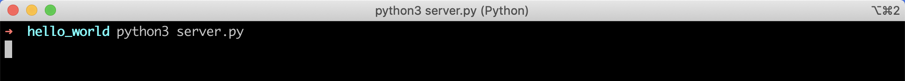

That is because, the first printing line is after the accept(). 

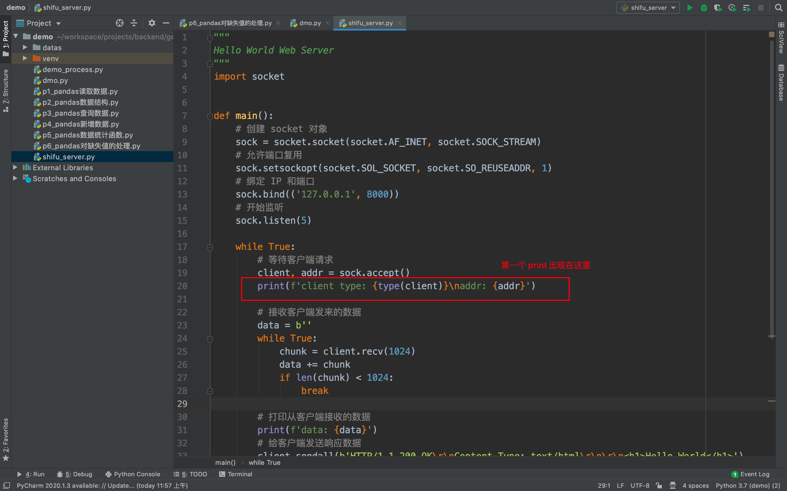

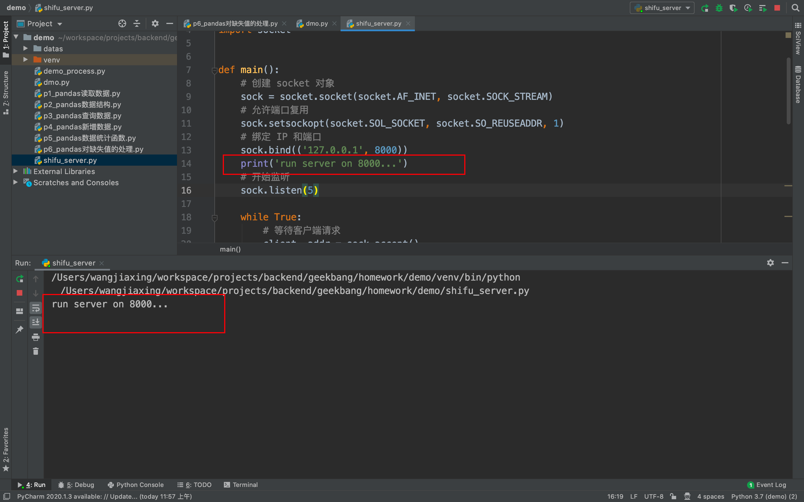

`accept()` returns an open connection between the server and client, **along with the address of the client**. The connection is actually a different socket on another port (assigned by the kernel). Data is read from the connection with `recv()` and transmitted with `sendall()`.

**There are two kinds of sockets which are created:**

* **The main socket**, which never rests. It is responsible for being alive forever in case clients can connect to the web application whenever they want. Since it already occupies a port by binding with an IP address and port, there is no need for a small socket to do that.
* **The small sockets**, which are assigned to every single client which is connecting to the server. Note that this is not the socket of client, because client and server are in different programs, it is not possible for the server to control the program of client. Therefore, the client `client, address = s.accept()` is the small socket which is assigned to connect with the client, while the address is the only information which the server can get about the client: the IP address and the port which the client is currently using. 

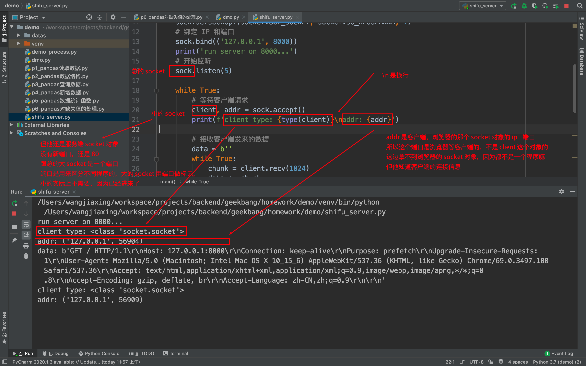

For illustration:

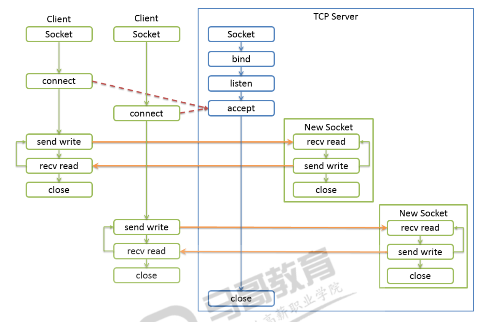


```python
    try:
        print(>>sys.stderr, 'connection from', client_address)

        # Receive the data in small chunks and retransmit it
        while True:
            data = connection.recv(16)
            print(>>sys.stderr, 'received "%s"' % data)
            if data:
                print(>>sys.stderr, 'sending data back to the client')
                connection.sendall(data)
            else:
                print(>>sys.stderr, 'no more data from', client_address)
                break
            
    finally:
        # Clean up the connection
        connection.close()
```

When communication with a client is finished, the connection needs to be cleaned up using `close()`. This example uses a `try:finally` block to ensure that `close()` is always called, even in the event of an error.

### The Client

An application, such as Chrome or Firefox, that runs on a computer and is connected to the internet. Its primary role is to **take user interactions and translate them into requests to another computer called a web server**. Although we typically use a browser to access the web, you can think of your whole computer as the “Client” piece of the client-server model. Every client computer has a unique address called an IP address that other computers can use to identify it.

Forms of the client (for further details, refer to the third section - Wrap Up):

* Web broswer
* Terminal
  * Curl
  * Ping
* Within a code file: the Requests module

#### Client-Side Coding

The client is what the user interacts with. So “client-side” code is responsible for most of what a user actually sees. This includes:

1. Defining the **structure** of the web page
2. Setting the **look and feel** of the web page
3. Implementing a mechanism for responding to **user interactions** (clicking buttons, entering text, etc.)

**Structure:** The layout and content of your webpage are defined by HTML (usually HTML 5 when it comes to web apps these days, but that’s another story.)

HTML stands for Hyper Text Markup Language. It allows you to describe the basic physical structure of a document using HTML tags. Each HTML tag describes a specific element on the document.

A web browser uses these HTML tags to determine how to display the document.

**Look and Feel:** To define the look and feel of a webpage, web developers use CSS, which stands for Cascading Style Sheets. CSS is a language that that lets you describe how the elements defined in your HTML should be styled, allowing changes in font, color, layout, simple animations, and other superficial elements.

**User interactions:** Lastly, JavaScript comes into the picture to handle user interactions.

Some user interactions, like the one above, can be handled without ever having to reach out to your server — hence the term “client-side JavaScript.” Other interactions require that you send the requests to your server to handle.

For example, if a user posts a comment on a thread, you might want to store that comment in your database to keep all the riff-raff organized in one place. So, you’d send the request to the server with the new comment and user ID, and the server would listen for those requests and process them accordingly.

#### How does a client work: Socket

The client program sets up its [`socket`](https://pymotw.com/2/socket/index.html#module-socket) differently from the way a server does. Instead of binding to a port and listening, it uses `connect()` to attach the socket directly to the remote address.

```python
import socket
import sys

# Create a TCP/IP socket
sock = socket.socket(socket.AF_INET, socket.SOCK_STREAM)

# Connect the socket to the port where the server is listening
server_address = ('localhost', 10000)
print(>>sys.stderr, 'connecting to %s port %s' % server_address)
sock.connect(server_address)
```

After the connection is established, data can be sent through the [`socket`](https://pymotw.com/2/socket/index.html#module-socket) with `sendall()` and received with `recv()`, just as in the server.

```python
try:
    
    # Send data
    message = 'This is the message.  It will be repeated.'
    print(>>sys.stderr, 'sending "%s"' % message)
    sock.sendall(message)

    # Look for the response
    amount_received = 0
    amount_expected = len(message)
    
    while amount_received < amount_expected:
        data = sock.recv(16)
        amount_received += len(data)
        print(>>sys.stderr, 'received "%s"' % data)

finally:
    print(>>sys.stderr, 'closing socket')
    sock.close()
```

When the entire message is sent and a copy received, the socket is closed to free up the port.

## Wrap Up: Connections - Network Protocols for Web Browsers and Servers

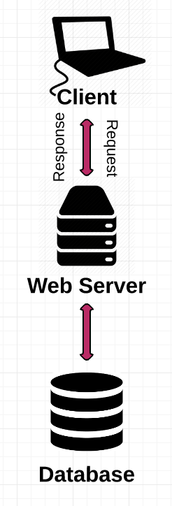

Web browsers and servers communicate using [TCP/IP](https://www.lifewire.com/transmission-control-protocol-and-internet-protocol-816255). [Hypertext Transfer Protocol](https://www.lifewire.com/hypertext-transfer-protocol-817944) is the standard application protocol on top of TCP/IP supporting web browser requests and server responses. **The purpose of HTTP is to make sure that the messages between the server and the client follow a certain rules (e.g. header, body)**. 

Web browsers also rely on [DNS](https://www.lifewire.com/what-is-dns-domain-name-system-2625855) to work with [URLs](https://www.lifewire.com/definition-of-uniform-resource-locator-817778). These protocol standards enable different brands of web browsers to communicate with different brands of web servers without requiring particular logic for each combination.

Like most internet traffic, web browser and server connections typically run through a series of intermediate [network routers](https://www.lifewire.com/what-is-a-router-2618162).

### A standard procedure of web browsing

(1) 我们在输入 https://www.google.com:443 的时候，我们是在访问https协议下www.google.com这个服务器网址的443端口

(2) 浏览器的DNS会把url转成google的外网IP地址，从而客户端与服务端建立 tcp 连接。客户端会发给服务端自己的信息，包含IP地址和端口。具体而言，是外网IP地址和客户端的操作系统分配给应用程序的端口

(3) 建立tcp连接之后，开始发送https请求，我们这儿就是发送get请求，获得google的主页

(4) google服务器查看这个请求hmtl网页是否存在，存在的话就返回response，不存在的话返回404信息

(5) 客户端获得应答的时候，浏览器首先得到html，不等待，马上解析有没有css js 等，然后边发请求边渲染，第6步你的疑惑是包不全咋办，就是他不管了，直接全渲染出来，比如有时候网速慢，图片没出来呢，网页先显示出来了，然后图片获取一点就渲染一点，所以有时候是半截图片

(6) 如果获得的包齐全，客户端就开始组装网页，最后呈现给用户完整的网页

(7) 客户端与服务端的连接关闭，并且客户端的端口也结束占用。服务端那边的端口不会结束占用，因为服务器需要一直运行

A basic web browsing session works like this:

- A person specifies a URL in a browser.
- The browser initiates a TCP connection to the server or server pool (using port 80, by default) through its [IP address](https://www.lifewire.com/what-is-an-ip-address-2625920), as published in DNS. As part of this process, the browser also makes DNS lookup requests to convert the URL to an IP address.
- After the server completes the acknowledgment of its side of the TCP connection, the browser sends HTTP requests to the server to retrieve the content. In our case, your web browser sends an HTTP request to the web server for the main HTML web page of www.github.com.
- After the server replies with content for the page, the browser retrieves it from the HTTP packets and displays it accordingly. **Content can include embedded URLs for advertising banners or other external content, which in turn triggers the browser to issue new TCP connection requests to those locations**. The browser may also save temporary information, called cookies, about its connections to local files on the client computer.
- Any errors encountered during the request for the content might appear as [HTTP status lines.](https://www.lifewire.com/http-status-lines-2623465) The web server receives the request and looks for that HTML page. If the page exists, the web server prepares the response and sends it back to your browser. If the server cannot find the requested page, it will send an HTTP 404 error message, which stands for “Page Not Found”.
- Your web browser takes the HTML page it receives and then parses through it doing a full head to toe scan looking for other assets that are listed, such as images, CSS files, JavaScript files, etc.
- For each asset listed, the browser repeats the entire process above, making additional HTTP requests to the server for each resource.
- Once the browser has finished loading all other assets that were listed in the HTML page, the page will finally be loaded in the browser window and the connection will be closed

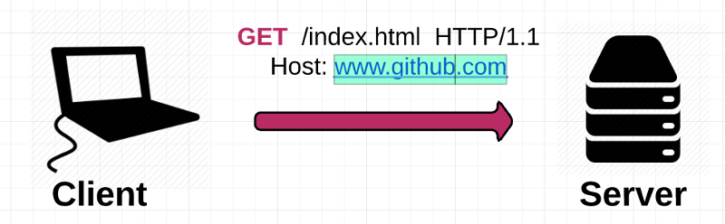


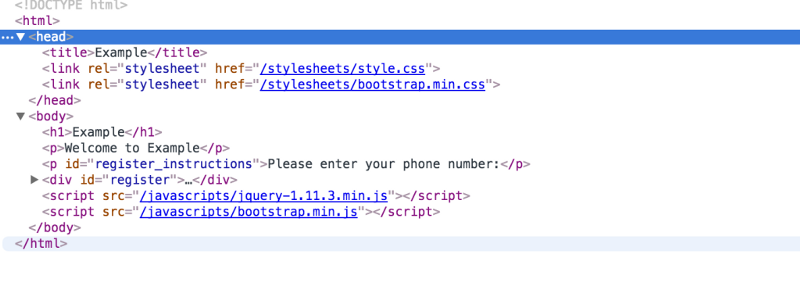

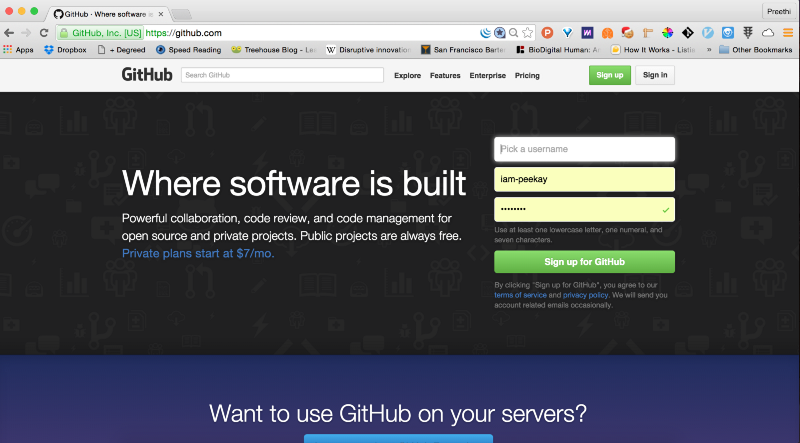


### Different forms of the client to connect to the server

From the perspective of client, there are several ways to connect to the server:

* From the browser
* Terminal
  * Curl
  * Ping (no need to specify the port)
* Within a code file: the requests module
* Postman

#### From the Browser

A web broswer does a lot of things for us. 

Firstly, run the server.py.

Secondly, open the broswer, input the link: 127.0.0.1:8000


#### Terminal

##### Curl

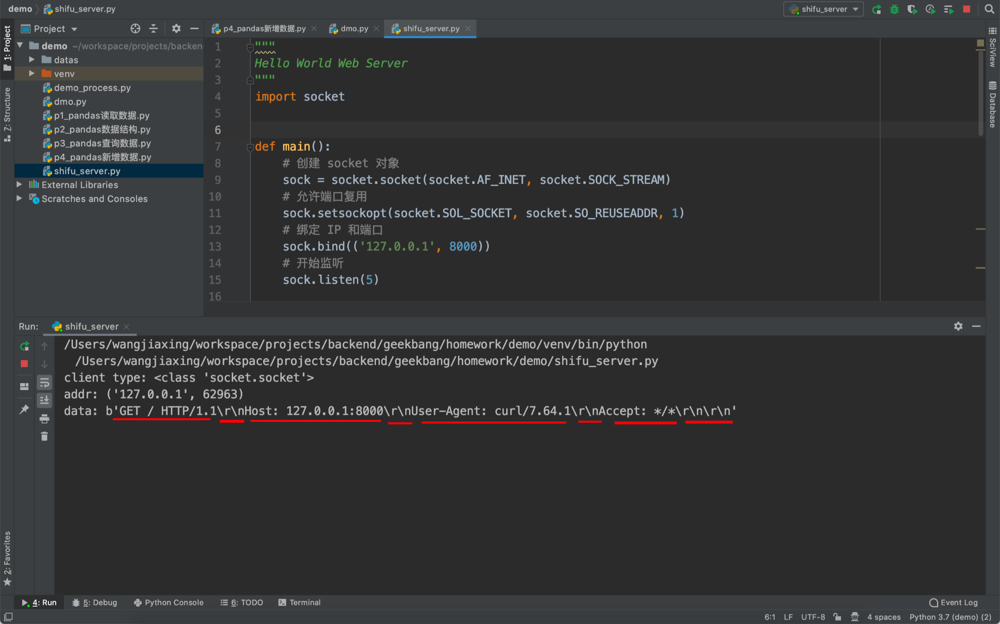

##### Ping

#### Within a Code File: the Requests Module

**Please note: we can't get access to our localhost if we have no server. The reason why we can send get requests directly to a website is that it has a server. However, in our case, we have to build a server before we use the Requests module to fetch a webpage.**

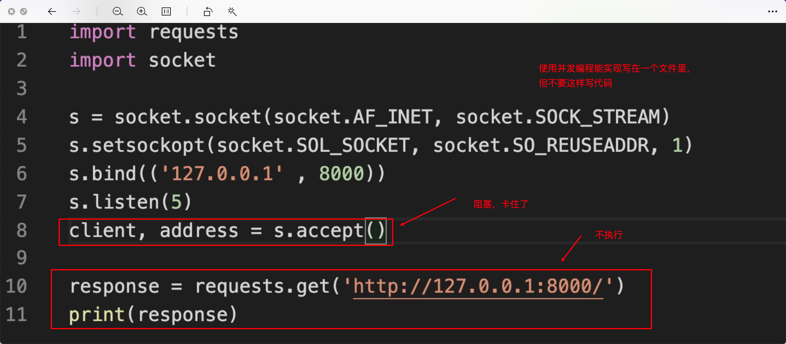

Instead, we need to do this:

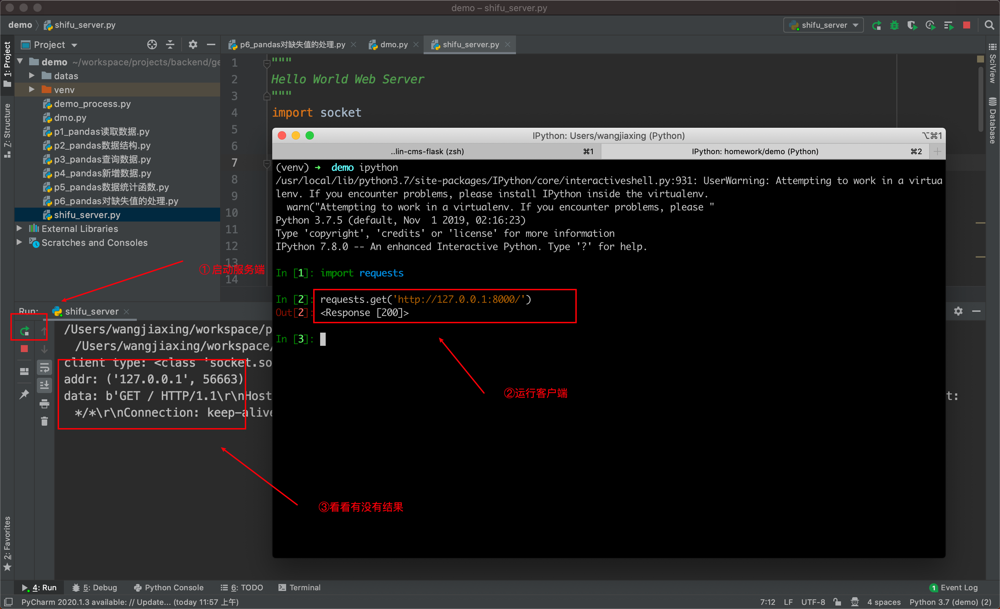

Or we can write these lines in a py file, firstly run the server.py, and then run the my_requests.py.


果然 requests 库发请求默认支持这两种压缩格式：

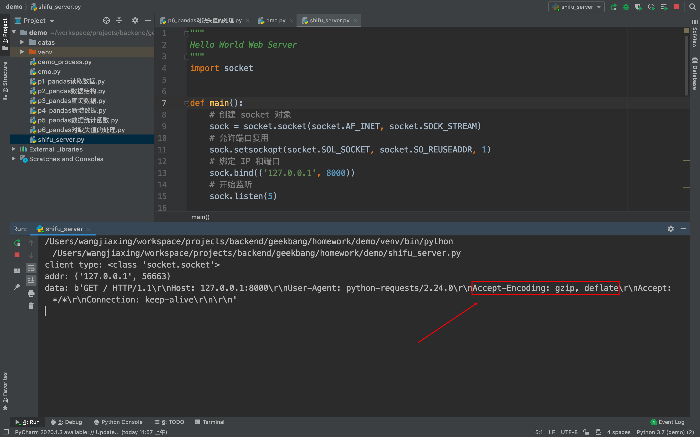

#### Postman

## TCP/IP

One thing worth noting is how information gets transmitted when you make a request for information. When you make a request, that information is broken up into many tiny chunks called packets. Each packet is tagged with a TCP header, which include the source and destination port numbers, and an IP header which includes the source and destination IP addresses to give it its identity. The packet is then transmitted through ethernet, WiFi or Cellular network and is allowed to travel on any route and take as many hops as it needs to get to the final destination.

(We don’t actually care how the packets get there — all that matters is that they get to the destination safe and sound!) Once the packets reach the destination, they are reassembled again and delivered as one piece.

So how do all the packets know how to get to their destination without getting lost?

The answer is TCP/IP.

TCP/IP is a two-part system, functioning as the Internet’s fundamental “control system”. IP stands for Internet Protocol; its job is to send and route packets to other computers using the IP headers (i.e. the IP addresses) on each packet. The second part, Transmission Control Protocol (TCP), is responsible for breaking the message or file into smaller packets, routing packets to the correct application on the destination computer using the TCP headers, resending the packets if they get lost on the way, and reassembling the packets in the correct order once they’ve reached the other end.

### Painting the final picture

But wait — the job isn’t done yet! Now that your browser has the resources comprising the website (HTML, CSS, JavaScript, images, etc), it has to go through several steps to present the resources to you as a human-readable webpage.

Your browser has a rendering engine that’s responsible for displaying the content. The rendering engine receives the content of the resources in small chunks. Then there’s an HTML parsing algorithm that tells the browser how to parse the resources.

Once parsed, it generates a tree structure of the DOM elements. DOM stands for Document Object Model and it is a convention for how to represent objects located in an HTML document. These objects — or “nodes” — of every document can be manipulated using scripting languages like JavaScript.

ip 地址是在网络中区分不同电脑的。
世界上无数台电脑，每个电脑都有自己的 IP，我大概跟你讲一下：
ip 分外网 ip 和内网 ip，
执行 ping www.baidu.com 时候，百度返回的那个 ip，你复制到浏览器同样能得到百度首页，使用上没有任何问题，180.101.49.11，这个 ip 叫外网 ip
但是外网 ip 全世界那么多电脑使用，就不够了，所以还有个内网 ip，简单理解，就是我们的路由器那个 ip，就是和百度一样的外网 Ip，然后一个路由器可以分配上百个内网 ip，所以上百个电脑对外的时候只有同一个 ip，所以 ip 就够用了(现在是不够用了，但新出来一个 ipv6，你现在先不用理解)
内网 ip 是以 192.168.xxx.xxx 这种开头的(有好几种内网 ip)
最后一个特殊的 ip 叫 127.0.0.1 ，本机 ip，内网 IP 就是你用了的话，使用同一个路由器的电脑能互相通讯，但外网连不上来。
如果咱们sock.bind(('127.0.0.1', 8000))，跟你使用同一个路由器的电脑也连不上来，只有你自己能连
所以第一个问题，如果咱们不再是localhost的网页，那大socket绑定的IP会是啥样？可能长这样sock.bind(('192.168.3.14', 8000))，用这个的话，就是内网，同一个路由器下电脑可以连接
这样sock.bind(('', 8000))就是所有都能连，不管本机、内网、外网（前提是你能有外网映射）

External IP address: curl ipecho.net/plain ; echo


昨天给你讲的 ip 端口啥的你应该能理解个大概了，我在给你详细讲一下昨天的问题
1. 那大socket绑定的IP会是啥样？
一般部署的时候就是空字符串，因为要让所有客户端电脑都能访问嘛
2. 大socket绑定的端口，还是像咱们之前说的，选一个没这么小的也在限定值的就好？
对外的时候，就像百度，谷歌啥的，我们访问域名就行了，不用加端口，实际上域名跟ip有一一对应关系，但端口的话不在域名里，而我们访问百度、谷歌都没有加端口，是因为他们使用了默认端口，http 默认端口 80，https 默认端口 443，所以我们网站如果对外一般也这么搞，如果不使用默认端口，和本地没区别，爱用啥用啥
3. 以及小socket能拿到的客户端IP和端口的话，端口是操作系统的分配我理解，那IP会是啥样的呢，还是这个127.0.0.1嘛？
如果本地访问就是 127.0.0.1，如果内网其他电脑访问，就是 192.168.3.133 这种类似的，如果外网访问，比如我们去访问百度、谷歌的时候，他们收到的是我们的外网 IP。

所以这个外网 IP 就引发一个问题：
一个学校、一个网吧、一个小区等，可能只有一个外网 IP，内部通信全是内网，所以服务器端做反爬虫的时候要格外小心，尽量不要使用封 IP 的手段，如果要封 IP，一定要有足够的把握，对方是爬虫程序，但封 IP 都是封几个小时，一般不会有人永久封的，因为假如学校了有个学生写了个爬虫，就会封了一个学校的 IP，学校所有人都无法上这个网站，对用户流失是很严重的，这个手段实际上是很有效的反爬策略，但属于杀敌一千，自损八百。


百度网页是部署在百度自己的服务器上的，谷歌网页是部署在谷歌自己的服务器上的，他们服务器那台电脑只有这一个程序是 80 或 443 端口，不可能同时多个程序用同一个端口，然后我们浏览器访问的时候，是访问服务端，人家用的这个端口，我们访问这个端口才能连通，然后浏览器客户端自己会由操作系统自动分配一个端口，这个是客户端端口，80/443 是服务端端口。

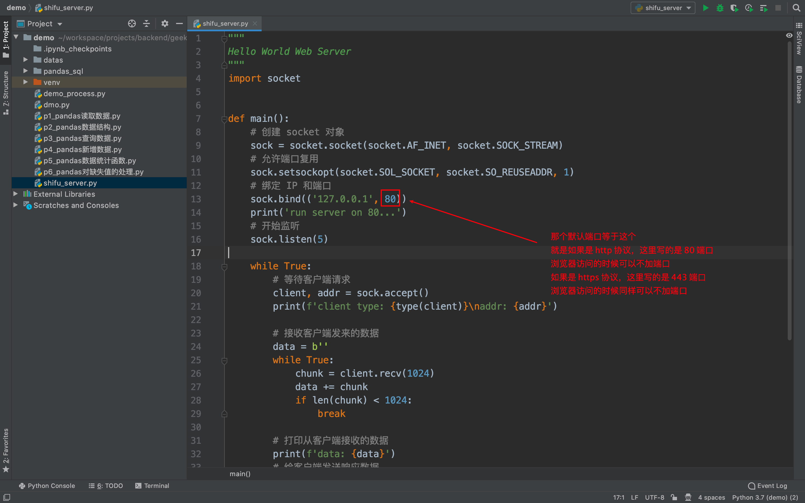

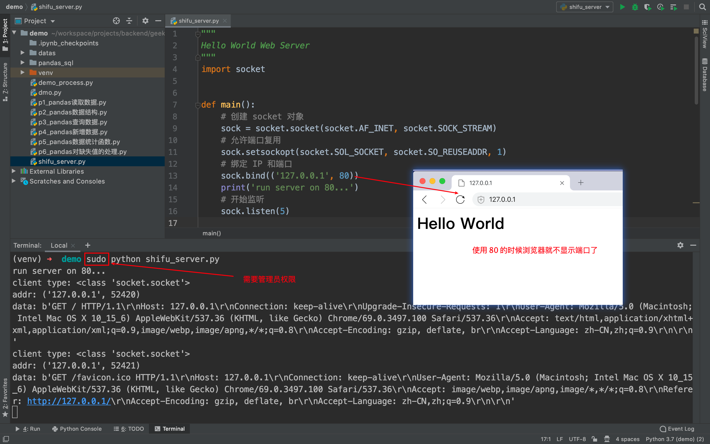

很多教程把ajax说的太玄乎了😂甚至还有书专门讲ajax，实际上把它理解为python的requests库就行了，只不过在需要评论的时候用js 发送 ajax 请求获取数据，然后 js 把数据填到网页上显示。

## HTTP

In the Client-Server model, clients and servers exchange messages in a “request–response” messaging pattern: the client sends a request and the server returns a response.

Keeping track of those messages is trickier than it sounds, so the client and server adhere to a common language and set of rules so they know what to expect. This language, or “protocol,” is called HTTP.

The HTTP protocol defines the syntax (the data format and encoding), semantics (the meaning associated with the syntax) and timing (speed and sequencing). Each HTTP request and response exchanged between a client and server is considered a single **HTTP transaction**.

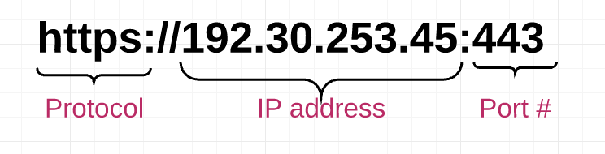

### Request message


```python
'GET / HTTP/1.1\r\nHost: 127.0.0.1:8000\r\nUser-Agent: python-requests/2.23.0 \r\nAccept-Encoding: gzip, deflate\r\nAccept: */*\r\nConnection: keep-alive\r\n\r\n'
```

* 请求行
  * 请求方法：GET
  * URL：Host: 127.0.0.1:8000
  * 协议版本：HTTP/1.1
* 请求头
  * User-Agent
  * Accept-Encoding
  * Accept：告诉服务端，客户端接受什么类型的响应（如Accept:text/plain）
  * Connection
* 请求数据

### Response Message


